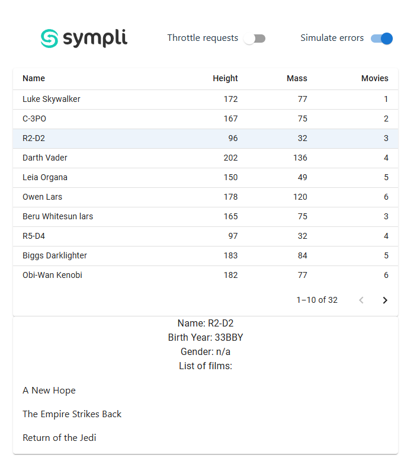

Hi there!

Your task is to implement missing logic related to fetching data into our SwapiPeopleTable in a React/Redux style. The application should load data upon launching.

We have prepared the core structure, all the necessary components and Redux wiring. Please continue with implementing the missing functionality.

Searching for `TODO` comments will give you hints however it's up to you whether or not to follow it.

The **expected result** should look like the picture below, with pagination and row selection working.
When user clicks on the row, the application should display some basic person details including the list of films.
If any of the film requests have failed, you should ignore the failure and display only the successfully resolved films.
The rendered list of films should be sorted alphabetically.

- Data should be fetched from provided JSON mock files (see `public/mocks` folder).
- Use our `http` utility that we prepared for you in `src/utils/http.ts`.
- Please pay attention to the throttle functionality provided that allows you to simulate server response delay.

You may notice that there is a chance of racing condition to happen, where films displayed does not belong to the selected person. This can be simulated by user clicking on multiple rows when throttling is on. Please make sure you take care of this..

You are allowed to modify any of the core functionality except `http` utility.

Please do not call any external API.

